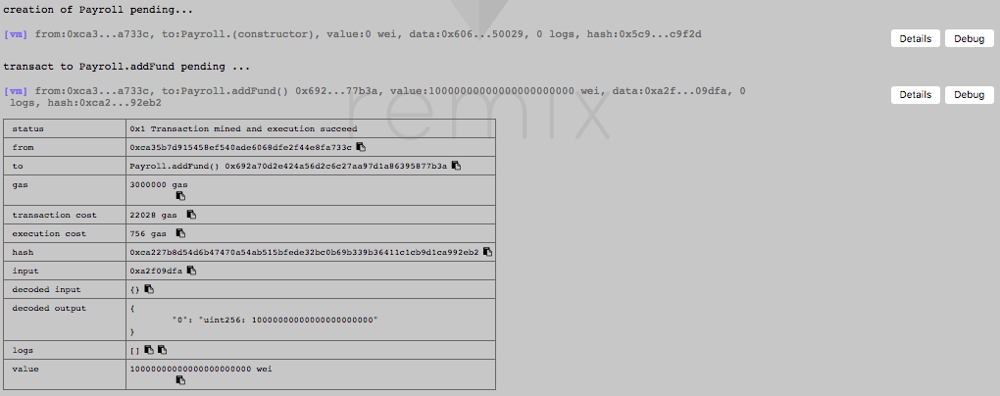

# Screenshots of Function Execution

## Owner Operations
0. Create contract Pyaroll.
1. Add 10000 ether to the contract:
```
addFund();
```


2. Add employee2:
```
addEmployee("0x14723a09acff6d2a60dcdf7aa4aff308fddc160c", 1);
```


3. Add employee3:
```
addEmployee("0x4b0897b0513fdc7c541b6d9d7e929c4e5364d2db", 2);
```


4. Update employee3 salary:
```
updateEmployeeSalary("0x4b0897b0513fdc7c541b6d9d7e929c4e5364d2db", 4);
```


5. Remove employee2:
```
removeEmployee("0x14723a09acff6d2a60dcdf7aa4aff308fddc160c");
```


6. Calculate runway:
```
calculateRunway();
```


7. Check if the contract has enough fund:
```
hasEnoughFund();
```


## Employee Operations
8. Employee2 (leave-office employee) gets severance pay:
```
getSeverancePay();
```


9. Employee3 changes his payment address:
```
changePaymentAddress("0x583031d1113ad414f02576bd6afabfb302140225");
```


10. Employee3 gets paid using the new payment address:
```
getPaid();
```

